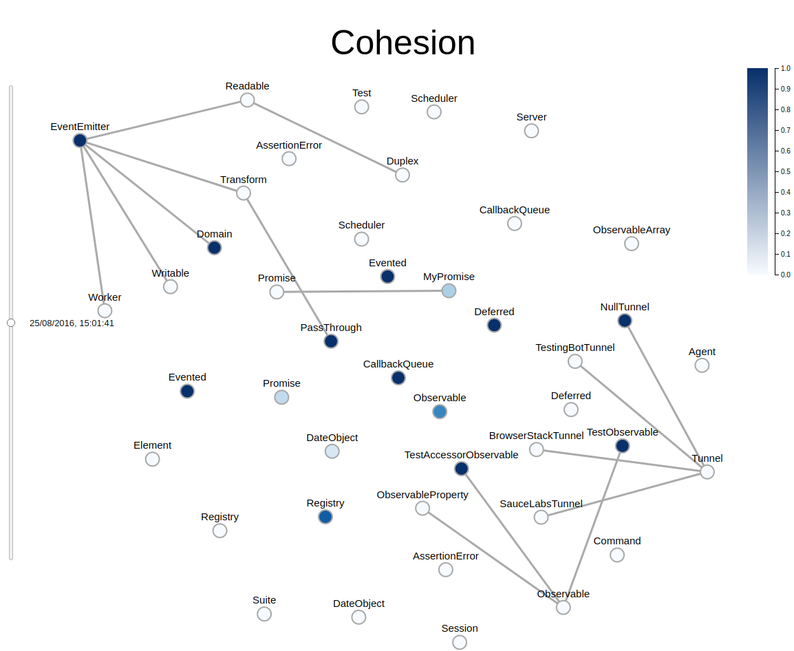

# [Cohesion]
A tool for analyzing code cohesion over time, by [Object Object]. For Typescript only. 

## Instructions

1. Cd into the 410-analysis folder and run ‘npm install’.
2. Run the oo.sh script with a github repo url
3. Open the index.html file in the vis folder

An additional (more hands-on) approach:

1. Cd into the 410-analysis folder and run ‘npm install’.
2. Clone the git repository that you want to analyze. 
3. Run oo.sh in top level of repo to 
3. Execute index.js with the path of the git repository.

This should produce an output file called graph.json with the raw data 

5. Next run a bash script to populate all of the commits in the repository. 

6. Finally open the index.html file in the vis folder. 

This will use the generated output file to create an interactive timeline of your repository, displaying cohesion and code structure over time. 

## Example output

## How it all works 

### Cohesion Analysis 
The actual cohesion calculation & language parsing, done by:
* Searching for all .ts files in the repo, and calling the parser on them
* Creating an 'estree' of all the .ts files, and walking through the estree to get necessary data on 
  function variable usage and class variables, passing that to the parser
* Calculating cohesion variables per TypeScript class, and returning these values along with any dependencies as a json file

### The Glue 
A script that clones a given repo, then:
* goes in the repo and checks the last 10 commits (can be adjusted for however many)
* writes another script which has commands to run the cohesion analysis tool on all those commits
* runs that script

### The Visualization 
We used a d3 force graph to represent the classes 

* The nodes are labeled with the class names 
* The colors of the nodes represent how cohesive the class. The legend guides the user to interpret how the colors 
  relate to cohesion. The darker the color, the more cohesive the class is. 

We also used d3 to create the interactive timeline: 

* The timeline dial allows the user to display the state of the repository after every commit to the active branch. This 
  way users can examine how their project changed over time and consider improvements to their workflow or development style.

### Contributor Responsibilities:

### Cohesion Calculation:
    
#### Cody Newman
* Searching for all .ts files in the repo, and calling the parser on them.
* Utilises typescript-estree-parser package to generate an 'estree' ast which is then walked through and details relevant
  to the cohesion calculation (superclass/interface, and member variables/function use) are parsed out.
#### Matteo Alps-Mocellin
* Parses the passed in estree details on member variable / function use to calculate class cohesion for each node,
  and to generate the final node and link formats for the graph timeline.
* Testing and data generation
    
### Visualization:
#### Anastasiya Sokha
* Created the graph: nodes for each class, labels for the nodes, relationship links between the nodes, mapping of 
  cohesion coefficient to hue, and legend
* emotional support for shev

#### Shevonne Cheung
* Created the timeline slider and updated the graph per selected commit

### The Glue:
#### Sam Parhimchik
* tied together the cohesion calculation and visualization parts with a fancy shell script
* Wrote a python script to analyze python class dependencies

