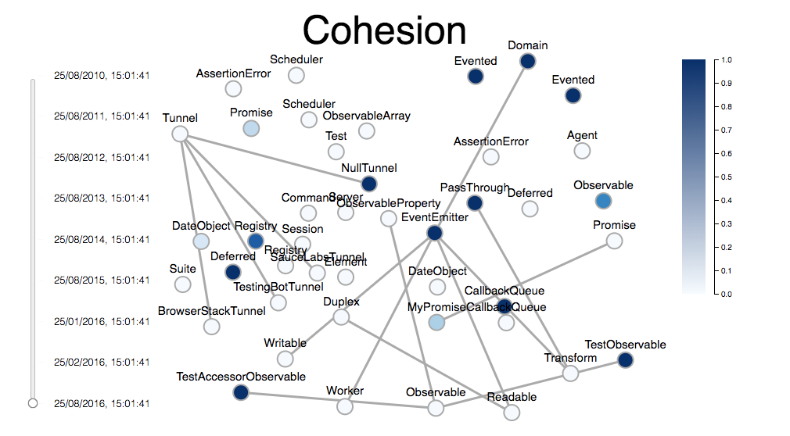

# [object object] 
A tool for analyzing code cohesion over time. For Typescript only. 

## Instructions

First the analysis must be performed: 
1. Cd into the 410-analysis folder and run ‘npm install’.
2. Clone the git repository that you want to analyze. 
3. Execute index.js with the path of the git repository.

This should produce an output file called graph.json with the raw data 

5. Next run a bash script to populate all of the commits in the repository. 

6. Finally open the index.html file in the vis folder. 

This will use the generated output file to create an interactive timeline of your repository, displaying cohesion and code structure over time. 

## Example output

## How it all works 

### Cohesion Analysis 

### The Glue 

### The Visualization 
We used a d3 force graph to represent the classes 

* the nodes are labeled with the class names 
* the colors of the nodes represent how cohesive the class. The legend guides the user to interpret how the colors relate to cohesion. The darker the color, the more cohesive the class is. 

We also used d3 to create the interactive timeline: 

* the timeline dial allows the user to display the state of the repository after every commit to the active branch. This way users can examine how their project changed over time and consider improvements to their workflow or development style. 
